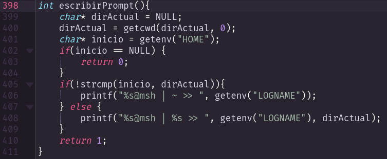

# my Kate color schemes

## Amora

This one is basically a port from the color scheme [this post](https://www.reddit.com/r/unixporn/comments/mykxnq/oc_amora_is_now_available_on_github/) has.

I'm still working around each and every particularity for every syntax highlighting style supported on Kate. Perhaps you will find half-baked things here and there. This is mainly a project for learning, but if anyone finds it useful be my guest.
